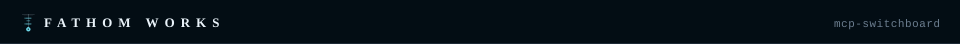

# `$ stats`

**A self-hosted web dashboard that aggregates usage and health metrics from multiple AI services and home infrastructure into a single view.** Configure your credentials once and check everything from one page.

---

## `[ what it monitors ]`

| Service | Data Shown |
|---------|------------|
| Claude.ai | Usage quotas and limits |
| Ollama.com | Bandwidth and resource utilization |
| Google Gemini | API request counts via Cloud Monitoring |
| Proxmox | VM and container status, CPU, memory, disk |
| Ceph | Cluster health, capacity, OSD status, throughput |
| TrueNAS SCALE | Pool health, alerts, network traffic |
| UniFi Network | Devices, clients, and WAN uptime/latency history |

Credentials are stored locally in a SQLite database and managed through the built-in settings page — nothing leaves your machine.

---

## `[ stack ]`

| Component | Technology |
|-----------|------------|
| Backend | Python 3.11 + Flask |
| Database | SQLite (via Flask-SQLAlchemy) |
| Deployment | Docker + Docker Compose |

---

## `[ quick start ]`

### 1. clone the repo

```bash
$ git clone https://github.com/jemplayer82/stats.git
$ cd stats
```

### 2. create the data directory

```bash
$ mkdir -p /storage/stats
```

### 3. start the container

```bash
$ docker compose up -d
```

The dashboard will be available at **http://\<your-host\>:5000**.

---

## `[ configuration ]`

Open `http://<your-host>:5000/settings` and enter credentials for the services you want to monitor:

| Service | What You Need |
|---------|---------------|
| Claude.ai | Session cookie from your browser |
| Ollama.com | Account session cookie |
| Google Gemini | Cloud service account JSON or API key |
| Proxmox | API token (`user@realm!tokenid` + secret) |
| TrueNAS SCALE | API key from the TrueNAS web UI |
| UniFi Network | **API key** (preferred) — or controller username/password |

Save and return to the dashboard — each service card populates automatically.

> **UniFi auth:** prefer an **API key** (UniFi → Settings → Control Plane → Integrations).
> It's stateless — sent as the `X-API-KEY` header with no login call — so it can't trip
> UniFi OS's login-attempt rate limit the way repeated username/password logins do. Username
> and password still work as a fallback when no key is set.

---

## `[ environment variables ]`

| Variable | Default | Description |
|----------|---------|-------------|
| `DATABASE_URL` | `sqlite:////data/usage.db` | SQLite path inside the container |

Data is persisted to `/storage/stats` on the host.

---

## `[ useful commands ]`

```bash
# View logs
$ docker compose logs -f

# Stop
$ docker compose down

# Rebuild after code changes
$ docker compose up -d --build
```

---


